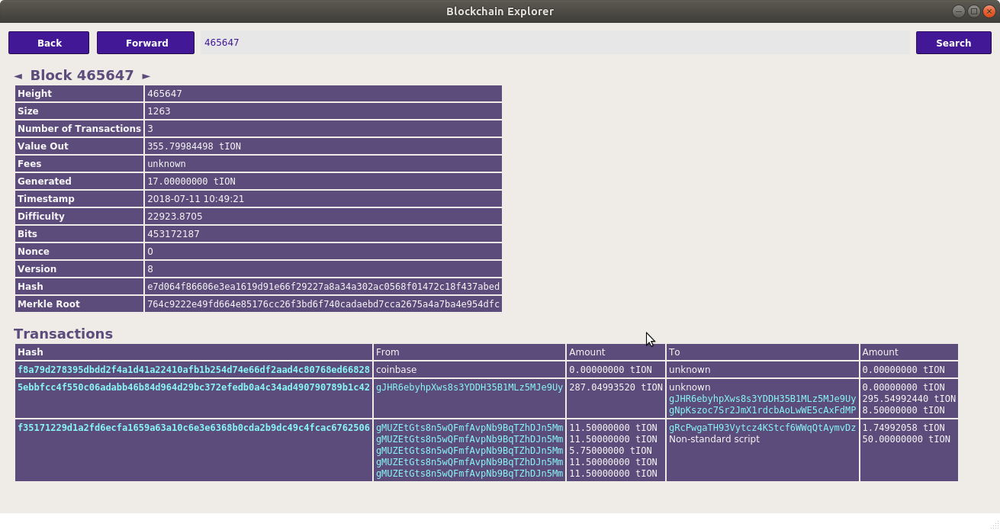

IIP 0001 - Voting proposal creating and voting process
=======================

[back to main page](README.md)

Ionomy created the ION Improvement Proposal (IIP) 0001 through 0005. 
IIP's need a community vote. ION uses the masternode budget functionality for this vote. 

Budgets go through a series of stages before being paid:
* prepare - create a special transaction that destroys coins in order to make a proposal
* submit - propagate transaction to peers on network
* voting - lobby for votes on your proposal
* get enough votes - make it into the budget
* finalization - at the end of each payment period, proposals are sorted then compiled into a finalized budget
* finalized budget voting - masternodes that agree with the finalization will vote on that budget
* payment - the winning finalized budget is paid

Enable payments through superblocks nor not?
------------------------

A masternode budget vote can result in payment of a reserved amount to the address specified in the prepared voting transaction. 
For this transaction to be paid out, superblocks must be enabled using the corresponding spork: SPORK_6_MASTERNODE_ENABLE_SUPERBLOCKS.
To verify this spork's status, check the spork values with the following command:
```
ion-cli spork show
```

The owner of the sporks private key can enable or disable this spork by starting ION Core with the spork private key and then setting the unix time from which point onward the spork should be enabled.

Starting the mainnet daemon with the spork key:
```
iond -sporkkey=<mainnet spork private key>
```

Starting the testnet daemon with the spork key:
```
iond -testnet -sporkkey=<testnet spork private key>
```

Enabling the superblock spork starting the current unix time:
```
ion-cli spork SPORK_6_MASTERNODE_ENABLE_SUPERBLOCKS `date +%s`
```

Disabling the superblock spork by setting the starting unix time to the default setting (January 1, 2099):
```
ion-cli spork SPORK_6_MASTERNODE_ENABLE_SUPERBLOCKS 4070908800
```

Prepare collateral transaction
------------------------

mnbudget prepare \<proposal-name\> \<url\> \<payment_count\> \<block_start\> \<ion_address\> \<monthly_payment_ion\> [use_ix(true|false)]

Example:
```
ion-cli -testnet=1 mnbudget prepare "IIP-0001" "https://github.com/ionomy/iip/blob/master/ION_IIP_0001.md" 1 465696 "gL65p47NPBLZnJMuagNgihvxNRTVaE7wUp" 50
```

Output: `f35171229d1a2fd6ecfa1659a63a10c6e3e6368b0cda2b9dc49c4fcac6762506` - This is the collateral hash, copy this output for the next step

The minimum amount for monthly payments is 10 ION, as defined in `CBudgetProposal::IsValid()`.

In this testnet transaction we prepare collateral for "_IIP-0001_". This proposal will pay 50 ION, 1 time over the course of a year totaling 50 ION. The budget preparation transaction destroys a transaction fee of 50 ION.




Submit proposal to network
------------------------

mnbudget submit \<proposal-name\> \<url\> \<payment_count\> \<block_start\> \<ion_address\> \<monthly_payment_ion\> \<collateral_hash\>

Example:
```
ion-cli -testnet=1 mnbudget submit "IIP-0001" "https://github.com/ionomy/iip/blob/master/ION_IIP_0001.md" 1 465696 "gL65p47NPBLZnJMuagNgihvxNRTVaE7wUp" 50 f35171229d1a2fd6ecfa1659a63a10c6e3e6368b0cda2b9dc49c4fcac6762506
```

Output: `736fa1791d27ece23ac72e6546d840c4b127022b3df28dbb3ffddb80164b331c` - This is your proposal hash, which other nodes will use to vote on it. 

Lobby for votes
------------------------

Double check your information:

mnbudget getinfo \<proposal-name\>

Example:
```
ion-cli -testnet=1 mnbudget getinfo "IIP-0001"
```
Output:
```
[
  {
    "Name": "IIP-0001",
    "URL": "https://github.com/ionomy/iip/blob/master/ION_IIP_0001.md",
    "Hash": "736fa1791d27ece23ac72e6546d840c4b127022b3df28dbb3ffddb80164b331c",
    "FeeHash": "f35171229d1a2fd6ecfa1659a63a10c6e3e6368b0cda2b9dc49c4fcac6762506",
    "BlockStart": 465696,
    "BlockEnd": 465841,
    "TotalPaymentCount": 1,
    "RemainingPaymentCount": 1,
    "PaymentAddress": "gL65p47NPBLZnJMuagNgihvxNRTVaE7wUp",
    "Ratio": 0,
    "Yeas": 0,
    "Nays": 0,
    "Abstains": 0,
    "TotalPayment": 50.00000000,
    "MonthlyPayment": 50.00000000,
    "IsEstablished": true,
    "IsValid": true,
    "IsValidReason": "",
    "fValid": true
  }
]
```

If everything looks correct, you can ask for votes from other masternodes. To vote on a proposal, load a wallet with a _masternode.conf_ file - or with a locally running masternode. When running a remote masternode, you do not need to access your cold wallet to vote for proposals.

It is possible to change your vote by voting again with that masternode, after a cool-off period of 1 hour.

`mnbudgetvote "local|many|alias" "votehash" "yes|no" ( "alias" )`

Example:
```
ion-cli -testnet=1 mnbudgetvote "local" 736fa1791d27ece23ac72e6546d840c4b127022b3df28dbb3ffddb80164b331c "yes"
```

Output:
```
{
  "overall": "Voted successfully 1 time(s) and failed 0 time(s).",
  "detail": [
    {
      "node": "local",
      "result": "success",
      "error": ""
    }
  ]
}
```

Make it into the budget
------------------------

After you get enough votes, execute `mnbudget projection` to see if you made it into the budget. Each voting period (1 month for mainnet), a maximum budget can be made available to fund projects. Winning budget proposals are ranked, and winning budgets are funded according to their ranking and the available budget.

 Note: Proposals must be active at least 1 day on the network and receive 10% of the masternode network in yes votes in order to qualify (E.g. if there are 560 masternodes, you will need 56 yes votes.)

Example:
```
ion-cli -testnet=1 mnbudget projection
```

Output:
```
[
  {
    "Name": "IIP-0001",
    "URL": "https://github.com/ionomy/iip/blob/master/ION_IIP_0001.md",
    "Hash": "736fa1791d27ece23ac72e6546d840c4b127022b3df28dbb3ffddb80164b331c",
    "FeeHash": "f35171229d1a2fd6ecfa1659a63a10c6e3e6368b0cda2b9dc49c4fcac6762506",
    "BlockStart": 465696,
    "BlockEnd": 465841,
    "TotalPaymentCount": 1,
    "RemainingPaymentCount": 1,
    "PaymentAddress": "gL65p47NPBLZnJMuagNgihvxNRTVaE7wUp",
    "Ratio": 1,
    "Yeas": 0,
    "Nays": 0,
    "Abstains": 0,
    "TotalPayment": 50.00000000,
    "MonthlyPayment": 50.00000000,
    "IsEstablished": true,
    "IsValid": true,
    "IsValidReason": "",
    "fValid": true
  }
]
```

Finalized budget
------------------------

```
"main" : {
        "FeeTX" : "f35171229d1a2fd6ecfa1659a63a10c6e3e6368b0cda2b9dc49c4fcac6762506",
        "Hash" : "736fa1791d27ece23ac72e6546d840c4b127022b3df28dbb3ffddb80164b331c",
        "BlockStart" : 465696,
        "BlockEnd" : 465841,
        "Proposals" : "IIP-0001",
        "VoteCount" : 46,
        "Status" : "OK"
    },
```

Get paid
------------------------

When block `465696` is reached you'll receive a payment for `50` ION - if SPORK_6_MASTERNODE_ENABLE_SUPERBLOCKS is enabled.


RPC Commands
------------------------

The following new RPC commands are supported:
- mnbudget "command"... ( "passphrase" )
 * prepare            - Prepare proposal for network by signing and creating tx
 * submit             - Submit proposal for network
 * vote-many          - Vote on a Ion initiative
 * vote-alias         - Vote on a Ion initiative
 * vote               - Vote on a Ion initiative/budget
 * getvotes           - Show current masternode budgets
 * getinfo            - Show current masternode budgets
 * show               - Show all budgets
 * projection         - Show the projection of which proposals will be paid the next cycle
 * check              - Scan proposals and remove invalid

- mnfinalbudget "command"... ( "passphrase" )
 * vote-many   - Vote on a finalized budget
 * vote        - Vote on a finalized budget
 * show        - Show existing finalized budgets
