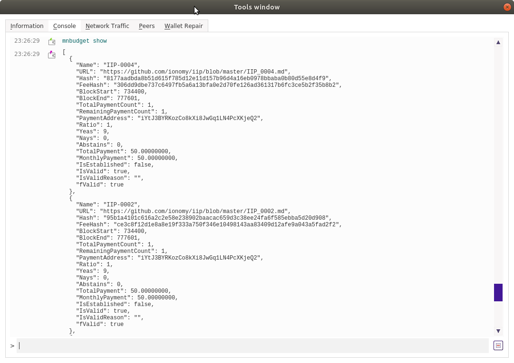

IIP - Voting on proposals
=======================

[back to main page](README.md)

Ionomy created the ION Improvement Proposal (IIP) 0001 through 0005. 
IIP's need a community vote. ION uses the masternode budget functionality for this vote. 

Proposals are created through a [Proposal creation transaction](IIP_vote_1.md), after which masternode owners can vote on the proposal.

View proposals
------------------------
Active proposals can be viewed through the debug console or with ion-cli.
The command to use is: mnbudget show



```
$ ion-cli mnbudget show
[
  {
    "Name": "IIP-0004",
    "URL": "https://github.com/ionomy/iip/blob/master/IIP_0004.md",
    "Hash": "8177aadbda8b51d615f785d12e11d157b96d4a16eb0978bbaba0b80d55e8d4f9",
    "FeeHash": "306dd9dbe737c6497fb5a6a13bfa0e2d70fe126ad361317b6fc3ce5b2f35b8b2",
    "BlockStart": 734400,
    "BlockEnd": 777601,
    "TotalPaymentCount": 1,
    "RemainingPaymentCount": 1,
    "PaymentAddress": "iYtJ3BYRKozCo8kXi8JwGq1LN4PcXKjeQ2",
    "Ratio": 1,
    "Yeas": 9,
    "Nays": 0,
    "Abstains": 0,
    "TotalPayment": 50.00000000,
    "MonthlyPayment": 50.00000000,
    "IsEstablished": false,
    "IsValid": true,
    "IsValidReason": "",
    "fValid": true
  },
  {
    "Name": "IIP-0002",
    "URL": "https://github.com/ionomy/iip/blob/master/IIP_0002.md",
    "Hash": "95b1a4101c616a2c2e58e238902baacac659d3c38ee24fa6f585ebba5d20d908",
    "FeeHash": "ce3c8f12d1e8a8e19f333a750f346e10498143aa83409d12afe9a043a5fad2f2",
    "BlockStart": 734400,
    "BlockEnd": 777601,
    "TotalPaymentCount": 1,
    "RemainingPaymentCount": 1,
    "PaymentAddress": "iYtJ3BYRKozCo8kXi8JwGq1LN4PcXKjeQ2",
    "Ratio": 1,
    "Yeas": 9,
    "Nays": 0,
    "Abstains": 0,
    "TotalPayment": 50.00000000,
    "MonthlyPayment": 50.00000000,
    "IsEstablished": false,
    "IsValid": true,
    "IsValidReason": "",
    "fValid": true
  },
  .....
```


View proposal information
------------------------

Check the information on an individual proposal as follows:

mnbudget getinfo \<proposal-name\>

Example:
```
ion-cli mnbudget getinfo "IIP-0001"
```
Output:
```
[
  {
    "Name": "IIP-0001",
    "URL": "https://github.com/ionomy/iip/blob/master/IIP_0001.md",
    "Hash": "f407b268393da3d264756e1947efa5cc11521a6075cdcfbd9a3fe416e87482d0",
    "FeeHash": "90ba0bbaa0f896089729370302ee8ef9c6d507571c24222a36a1a643677363c3",
    "BlockStart": 734400,
    "BlockEnd": 777601,
    "TotalPaymentCount": 1,
    "RemainingPaymentCount": 1,
    "PaymentAddress": "iYtJ3BYRKozCo8kXi8JwGq1LN4PcXKjeQ2",
    "Ratio": 1,
    "Yeas": 68,
    "Nays": 0,
    "Abstains": 0,
    "TotalPayment": 50.00000000,
    "MonthlyPayment": 50.00000000,
    "IsEstablished": false,
    "IsValid": true,
    "IsValidReason": "",
    "fValid": true
  }
]
```

Voting
------------------------
To vote on a proposal, load a wallet with a _masternode.conf_ file - or with a locally running masternode. Then find the proposal hash of the proposal you'd like to vote on: this is the "Hash" field in the returned proposal information. This string, and the vote ("yes" or "no") must be passed to the `mnbudgetvote` command.

Voting using a local masternode is done through specifyig `local` as a parameter. Voting using all remote masternodes is done using the `many` parameter. Voting using one specific remote masternode is done using the `alias` paramter, in addition to specifying the name of that speciific masternode.

It is possible to change your vote by voting again with that masternode, after a cool-off period of 1 hour.

`mnbudgetvote "local|many|alias" "votehash" "yes|no" ( "alias" )`

Example 1:
```
mnbudgetvote "many" 95b1a4101c616a2c2e58e238902baacac659d3c38ee24fa6f585ebba5d20d908 "yes"
```

Output:
```
{
  "overall": "Voted successfully 3 time(s) and failed 0 time(s).",
  "detail": [
    {
      "node": "mn1",
      "result": "success",
      "error": ""
    },
    {
      "node": "mn2",
      "result": "success",
      "error": ""
    },
    {
      "node": "mn3",
      "result": "success",
      "error": ""
    }
  ]
}
```

Example 2:
```
mnbudgetvote "local" 95b1a4101c616a2c2e58e238902baacac659d3c38ee24fa6f585ebba5d20d908 "no"
```

Output:
```
{
  "overall": "Voted successfully 1 time(s) and failed 0 time(s).",
  "detail": [
    {
      "node": "local",
      "result": "success",
      "error": ""
    }
  ]
}
```

Vote completion
------------------------

The `mnbudget show` command displays the block height of the end of the voting period, and the number of votes.

The first 5 proposals will run until block 734400, which is projected to occur 31th of July.